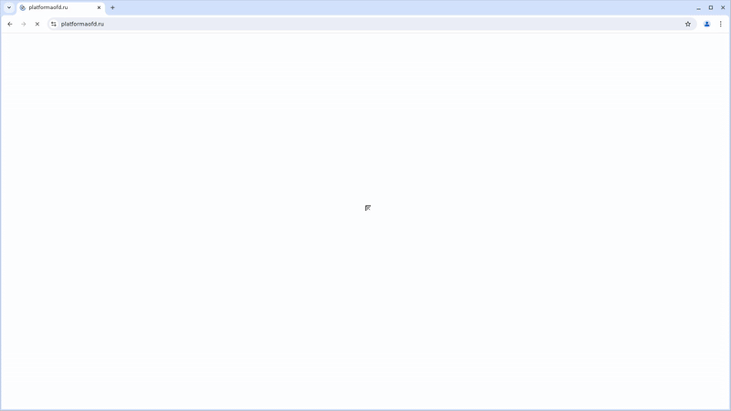

# Проект по автоматизации тестирования для компании **Platforma OFD**

Тестовый проект по автоматизации UI-тестов маркетингового сайта  
➡️ https://platformaofd.ru

Проект выполнен в рамках выполнения тестового задания для вакансии QA Engineer.

---

## 📌 Содержание

- [Технологии и инструменты](#технологии-и-инструменты)
- [Структура проекта](#структура-проекта)
- [Примеры автоматизированных тест-кейсов](#примеры-автоматизированных-тест-кейсов)
- [Сборка в Jenkins](#сборка-в-jenkins)
- [Запуск из терминала](#запуск-из-терминала)
- [Allure отчёт](#allure-отчёт)
- [Уведомления в Telegram](#уведомления-в-telegram)
- [Видео выполнения тестов в Selenoid](#видео-выполнения-тестов-в-selenoid)
- [Планы по развитию](#планы-по-развитию)

---

## 🛠 Технологии и инструменты

| Технология | Назначение |
|-----------|-----------|
| **Java 17** | язык разработки |
| **Gradle 8.5** | сборка проекта |
| **JUnit 5** | тестовый фреймворк |
| **Selenide 7.x** | UI-автоматизация |
| **Allure 2** | отчёты |
| **Selenoid** | удалённые браузеры |
| **Jenkins** | CI/CD |
| **Allure Notifications + Telegram Bot** | уведомления |

---

## 📁 Структура проекта

```text
platformaofd-ui-tests
├── build.gradle
├── settings.gradle
├── README.md
└── src
    └── test
        └── java
            ├── helpers
            │   └── Attach.java
            ├── pages
            │   └── HomePage.java
            └── tests
                ├── HomePageTests.java
                └── TestBase.java
```

## ✅ Примеры автоматизированных тест-кейсов

Все тесты находятся в классе **HomePageTests**  
и покрывают базовый «smoke»-набор для главной страницы.

---

### 🔎 Что проверяем

✔ **Открытие главной страницы**

- страница успешно открывается
- хедер отображается
- присутствуют ключевые тексты:
    - «Умные решения»
    - телефон **8 (495) 252-50-50**

---

✔ **Структура хедера**

Проверяем наличие основных пунктов меню:

- Сервисы
- Тарифы
- База знаний
- Рынкам
- Новым регионам
- О нас
- Акции

---

✔ **Навигация по главной**

Клик по кнопке **«Выбрать сервис»**:

- ведёт на страницу `/services`
- заголовок страницы содержит «Сервисы»

---

✔ **Блок «Сервисы»**

Проверяем наличие карточки:

- «оператор фискальных данных»

---

✔ **Блок «База знаний»**

В блоке присутствуют основные разделы:

- Кассы, чеки
- Личный кабинет
- ОФД
- ЭДО
- Отчётность
- Маркировка

---

✔ **Переход в базу знаний**

Клик по ссылке **«Перейти в Базу знаний»**:

- открывается `/baza-znaniy`
- текст содержит «База знаний»

---

✔ **Блок «Новости»**

Проверяем, что:

- есть хотя бы одна дата в формате **dd.MM.yyyy**

---

✔ **Переход к новости**

- клик по заголовку первой видимой новости
- открывается страница новости
- заголовок совпадает с выбранным

---

✔ **Футер — контакты**

Футер содержит:

- телефон
- email **info@platformaofd.ru**
- адрес: **Москва, ул. Усачёва, д. 33, стр. 1**

---

✔ **Футер — параметры подключения кассы**

В футере указаны параметры подключения:

- **URL:** ofdp.platformaofd.ru
- **IP:** 185.170.204.91
- **Порт:** 21101

---

### 🏷 Аннотации Allure

Каждый тест помечен аннотациями:

- `@Epic`
- `@Feature`
- `@Story`
- `@DisplayName`

Это делает отчёт:

- читаемым для бизнеса
- понятным для команды разработки
- удобным для анализа результатов

---

## 🚀 Сборка в Jenkins

### Параметры сборки

```text
TASK

BROWSER

BROWSER_VERSION

BROWSER_SIZE

REMOTE_URL
```

### Пример команды
```text
clean test \

-Dbrowser=${BROWSER} \

-DbrowserVersion=${BROWSER_VERSION} \

-DbrowserSize=${BROWSER_SIZE} \

-Dremote=${REMOTE_URL}
```
---
## 💻 Запуск из терминала

### Локальный запуск
```text
gradle clean test
```
### Запуск с параметрами
```text
gradle clean test \
-Dbrowser=chrome \
-DbrowserVersion=127.0 \
-DbrowserSize=1920x1080
```

---

## 📊 Allure отчёт

После выполнения сборки формируется Allure-отчёт, содержащий:

- список тест-кейсов
- шаги выполнения кейсов
- скриншоты
- видео
- логи браузера
- графики

### *Основная страница отчёта*


### *Тест-кейсы*


### *Графики*


---
## 🤖 Уведомления в Telegram


Бот отправляет:

- процент Passed
- количество тестов
- время выполнения
- ссылку на отчёт Allure

---

## 🎥 Пример видео выполнения теста в Selenoid

Для каждого теста сохраняется видео, доступное в Allure → Suites → TestCase → Tear down →
**Attachments**.



---

## 🚧 Планы по развитию

⬜ Добавить API-тесты  
⬜ Расширить покрытие UI  
⬜ Добавить Docker-инфраструктуру  
⬜ Добавить статический анализ кода